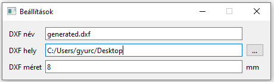

# DataMatrix Wizard

A program excel táblából generál DataMatrix-ot a megadott
paraméterekkel.

## Használat:

A program főképernyője:

### Főbb parancsok:
1. Fájl megnyitása:
   - megnyitja az excel fájlt
   - ha a kijelölt oszlop/sor kombinációban érvényes adat van, akkor egy előnézeti kép is megjelenik
2. Oszlop/Sor beállítás:
   - beállítja, hogy az excel melyik sorában és oszlopában történjen a keresés
3. Sraffozás beállítás:
   - beállítja a sraffozás szögét és sűrűségét
   - a sraffozás szöge 45 foktól van számolva
   - a sraffozás sűrűsége 3 hatványoknál lesz **majdnem** folytonos
4. Újratöltés:
    - amennyiben nem talált érvényes adatot, az Oszlop/Sor állítása után ezzel a gombbal lehet újratölteni 
   az adatokat az exel-ből
5. Generálás:
   - a megadott néven és elérési útra generál egy DXF fájlt

### Beállítások menü:

 - A *DXF név* beállítással a generált fájl nevét lehet megadni
 - A *DXF hely* beállítással a fájl mentési helyét lehet megadni
   * A *"..."* gombbal lehet tallózni
   * Ha hibás az elérési út, a szöveg pirosra vált
 - A *DXF méret* a generált DXF fájl méretét határozza meg

# Feladatok még:
   - [x] UI
   - [x] az éppen betöltött string kiíratása
   - [ ] futás optimalizálás

