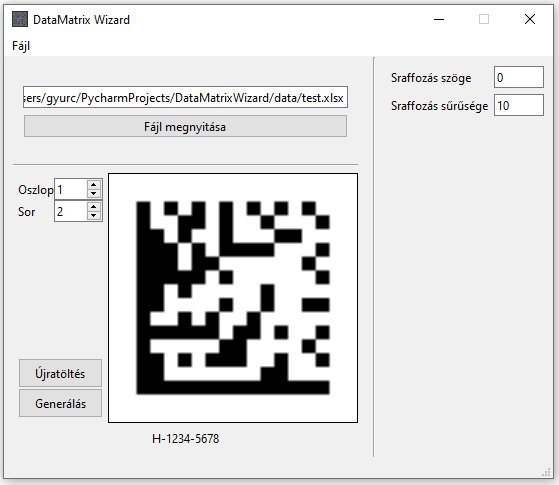

# DataMatrix Wizard

A program excel táblából generál DataMatrix-ot a megadott
paraméterekkel.

## Használat:

A program főképernyője:

### Főbb parancsok:
1. Fájl megnyitása:
   - megnyitja az excel fájlt
   - ha a kijelölt oszlop/sor kombinációban érvényes adat van, akkor egy előnézeti kép is megjelenik
2. Oszlop/Sor beállítás:
   - beállítja, hogy az excel melyik sorában és oszlopában történjen a keresés
3. Újratöltés:
    - amennyiben nem talált érvényes adatot, az Oszlop/Sor állítása után ezzel a gombbal lehet újratölteni 
   az adatokat az exel-ből

# Feladatok még:
   - [x] UI
   - [ ] az éppen betöltött string kiíratása
   - [ ] futás optimalizálás

